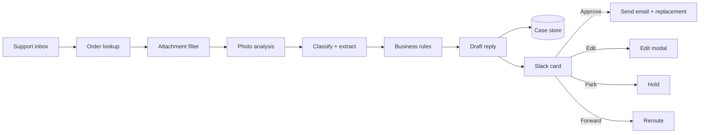

# Architecture

Human-in-the-loop support automation for an e-commerce store. The system
prepares everything and a person approves everything.

## Overview

## Workflows

| Workflow | Trigger | Role |
|---|---|---|
| Intake and diagnosis | Schedule, every 10 min | Inbox to Slack card |
| Slack actions | Slack interactivity webhook | Approve, edit, park, forward |

## Intake stages

**Inbox.** Polls the support mailbox through Microsoft Graph. In test mode it
loads 12 hardcoded emails instead.

**Dedup and continuation.** A case is keyed by conversation ID. A reply on an
open fault case inherits the fault flag, so a customer sending requested
photos is not reclassified as a non-fault message.

**Order lookup.** Shopify order search by customer email. Sets channel,
order number and SKU.

**Attachment filter.** Only `image/*` goes to vision. Video, PDF and other
types are recorded as unsupported and surfaced as a warning on the card.

**Photo analysis.** One vision call returns SKU, damage description, units
visible and confidence. A receipt proves identity, never damage. A detached
part with no body in frame returns low confidence and no SKU.

**Classification.** One structured-output call returns category, language,
channel, region, country, fault signals and flags. The email is wrapped in a
nonce fence and treated as data. A parse failure falls back to ESCALATE with
manual review.

**Business rules.** Plain code decides compensation. The model never does.
See `business-rules.md`.

**Draft.** Built from fixed templates in English, with a flag when
translation is needed. Banned phrases are checked and reported as warnings.

**Slack card.** Product, SKU, channel, country, compensation, root cause,
inquiry and draft, with Approve, Edit, Park and Forward buttons.

## Design decisions

- AI extracts and drafts. Code decides money.
- Nothing reaches a customer without a button press.
- Failures route to a person, not to a guess.
- Approve sends the stored draft, never the text shown on the card.
- Edits save the full text, then redraw the card from the saved value.
- Links outside the allowlist produce a warning. They are never stripped.
- Slack requests are verified with HMAC and a 5 minute timestamp window.

## Known gaps

- Slack actions workflow is a scaffold. Several nodes are empty and the
  Switch routes only the approve output.
- Several IF nodes in intake have no conditions configured.
- Compensation has no 50% path. `proposed_compensation_level` is not in the
  classification schema, so the model value is always ignored.
- Shopify draft order creation is not implemented.
- Banned phrase check runs on the English draft only.
- Error handler and health watchdog workflows are not built.
- Approve sends email before writing status, so a failed write can cause a
  duplicate send on retry.